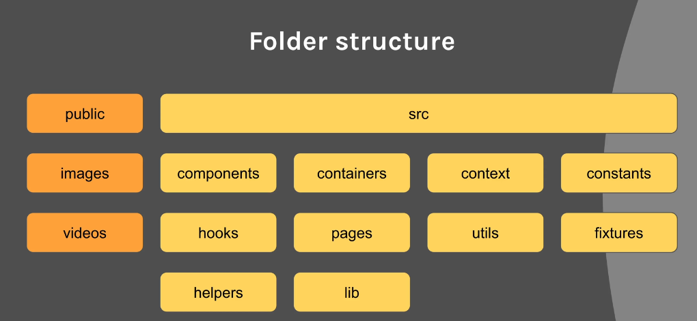
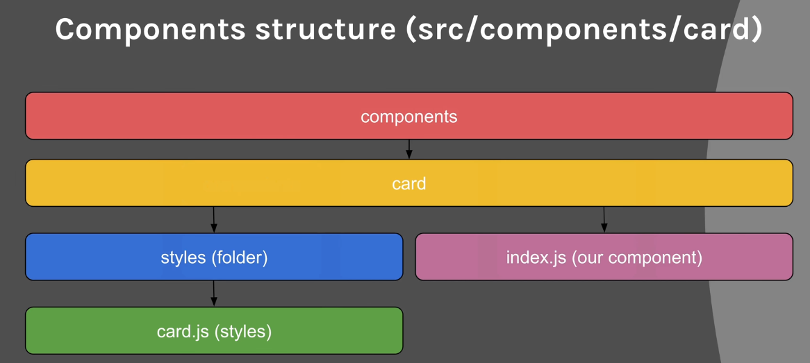
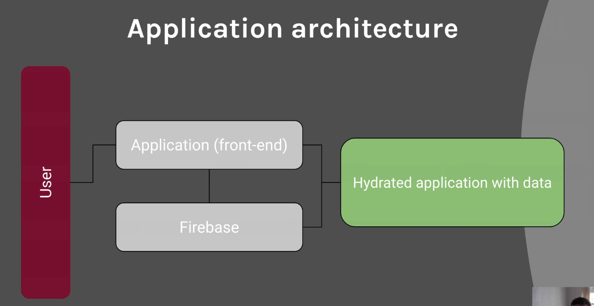

# Netflix Replication

This file is used to make notes, while I follow along the tutorial to replicate netflix website from a [youtube video](https://youtu.be/x_EEwGe-a9o?list=WL)

*So lets start*

**Time stamp 00:05:16**

**Dependencies**

    #Dependencies
    firebase >7.19.1
    fuse.js >6.4.1
    normalize.css >8.0.1
    react >16.13.1
    react-dom >16.13.1
    react-router-dom >5.2.0
    react-scripts >3.4.3
    styled-components >5.1.1

    #Scripts
    start: react-scripts start
    build: react-scripts build
    test: react-scripts test --converge --watchAll
    eject: react-scripts eject

    #devDependencies
    babel-eslint >10.1.0
    babel-plugin-macros >2.8.0
    eslint >6.8.0
    eslint-config-airbnb >18.1.0
    eslint-config-prettier >6.10.1
    eslint-plugin-import >2.20.2
    eslint-plugin-jsx-ally >6.2.3
    eslint-plugin-prettier >3.1.2
    eslint-plugin-react >7.19.9
    @testing-library/react >10.4.9
    prettier >2.0.4

# The Process (Ubuntu 20.04LTS)
- Installed nodejs using sudo apt install nodejs. Other method could have been using curl to add node PPA.(like done [here](https://speedysense.com/install-nodejs-on-ubuntu-20-04/))
- Installed npm. sudo apt install npm
- Installed create-react-app using cmd - sudo npm install create-react-app -g
- created netflix app using command--> $ create-react-app netflix
- A folder is created naming netflix and few commands are shown which we can use to create server.
  - **npm start**
    Starts the development server.
  - **npm run build**
    Bundles the app into static files for production.
  - **npm test**
    Starts a test server.
  - **npm run eject**
    Removes this tool and copies build dependencies, configuration files and scripts into app directory. If you decide to do this, you can't go back.
  - We suggest you start by typing
  - **cd app_folder**
  - **npm start**
- Edited few files shown exactly as in tuto.
- Added styled components.
- All components are added with there exact name just use npm instead of yarn.( as I am using npm)
- To search a running service on a port use lsof -i :port_number
- 